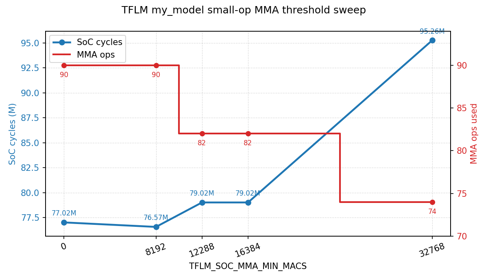
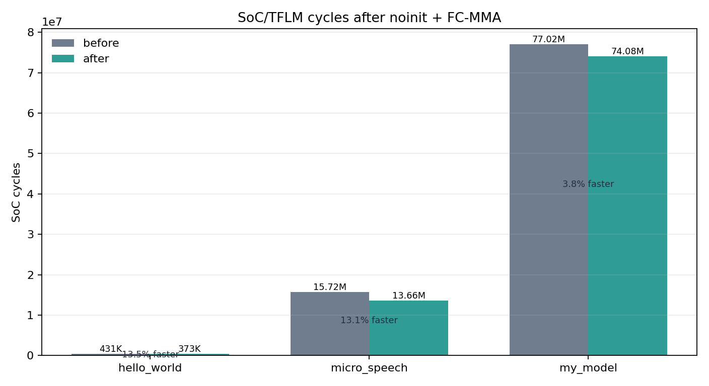
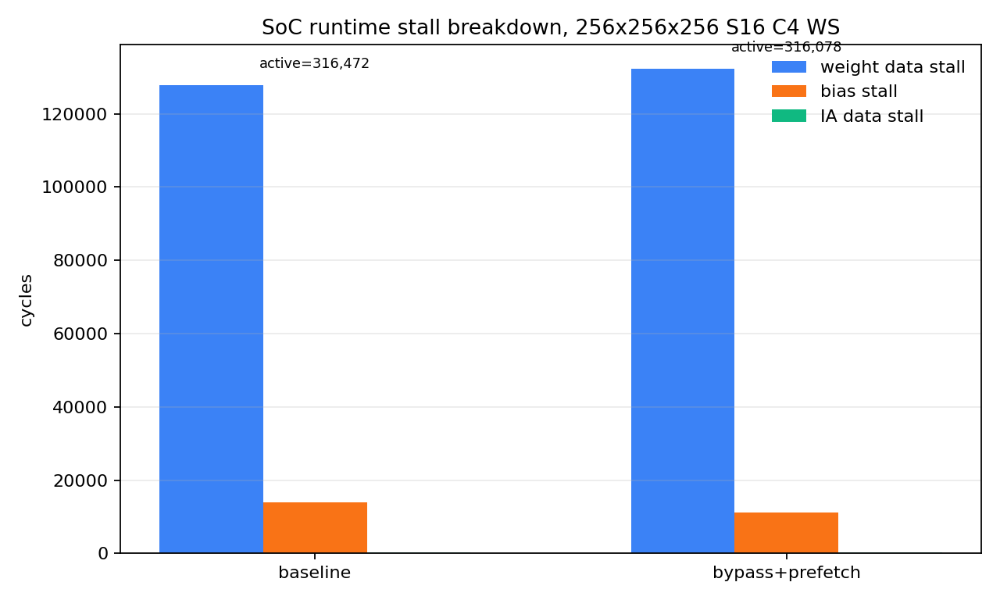

# MMA 新旧版本与 IA_CACHE_BLOCKS 性能分析报告

- 生成时间：2026-06-30 19:23:50
- 代码版本：`/media/proj_tmp/aiEngine_integrated` commit `0da2dcc`；旧版基线 `/media/proj_tmp/aiEngine_integrated_old_01d6506` commit `01d6506`
- 测试环境：DDR 随机延迟关闭；SoC 仿真；RISC-V 侧程序使用 `-O3`（旧版历史 TFLM 程序为旧 Makefile 配置）。
- 新版 MMA 配置：`MMA_SIZE=16`，`MMA_PS_FRAME_COUNT=16`，`lhs_dtype=s8`，`quant_mode=per-tensor`。
- 新版 cache sweep：`IA_CACHE_BLOCKS=[2, 4, 8]`，尺寸 `[64, 96, 128, 192, 224, 256]`，dataflow `[0]`，seed `88400`。
- 新版 sweep 结果：`18/18` 通过。

## 结论摘要

- 最终 WS sweep 中，新版 cached MMA 在 64/96/128/192/224/256 方阵上全部快于旧版 WS 基线，没有再出现负收益。
- `IA_CACHE_BLOCKS=8` 的新版 WS 相对旧版分别达到 3.34x/3.69x/4.03x/4.30x/4.27x/4.47x；矩阵放大后优势整体更明显。
- cache 增大带来的复用收益已经能在新架构内部稳定体现：C8 相对 C2 在所有 WS 尺寸上均更快，256 点降周期约 40.65%。
- 主要性能修复来自三处：OA 写回从单 beat 命令改成按输出行 burst；reuse=0 保留为 RTL 自动最大复用路径；runtime case 头和输出清零/比较去掉 volatile 字节循环开销。
- TFLM 端到端结果和裸 MMA 不完全一致：端到端包含算子调度、转置/打包、CPU 侧循环和模型结构，旧版部分大模型此前会 timeout；本报告使用加大 timeout 后的重跑日志更新该结论。
- 修改 `MMA_IA_CACHE_BLOCKS` 和 `MMA_PS_FRAME_COUNT` 时，驱动公式会同步改变：Makefile 把它们编译成 `-DDSA_IA_CACHE_BLOCKS=$(MMA_IA_CACHE_BLOCKS)` 和 `-DDSA_PS_FRAME_COUNT=$(MMA_PS_FRAME_COUNT)`。普通 SoC runtime 使用这两个宏选择并限制 reuse 参数；TFLM kernel 的直接 MMA 路径以 `SIZE` 列为一组提交，当前配置下 `W_REUSE=1`，主要受 `DSA_IA_CACHE_BLOCKS` 控制。

## 图 1：新版 cache 大小对周期的影响


## 新版 cache sweep 详细表

### dataflow=0 (WS)

| K=N=M | C2 cycles | C4 cycles | C8 cycles | C4 相对 C2 | C8 相对 C2 | C4 降周期 | C8 降周期 | C2 eff | C4 eff | C8 eff |
|---:|---:|---:|---:|---:|---:|---:|---:|---|---|---|
| 64 | 108,577 | 98,283 | 93,179 | 10.47% | 16.53% | 9.48% | 14.18% | R1/W4 | R2/W4 | R4/W4 |
| 96 | 241,008 | 206,528 | 194,957 | 16.70% | 23.62% | 14.31% | 19.11% | R1/W6 | R2/W6 | R4/W6 |
| 128 | 453,189 | 371,787 | 331,013 | 21.89% | 36.91% | 17.96% | 26.96% | R1/W8 | R2/W8 | R4/W8 |
| 192 | 1,173,994 | 900,206 | 762,978 | 30.41% | 53.87% | 23.32% | 35.01% | R1/W12 | R2/W12 | R4/W12 |
| 224 | 1,713,502 | 1,279,170 | 1,092,294 | 33.95% | 56.87% | 25.35% | 36.25% | R1/W14 | R2/W14 | R4/W14 |
| 256 | 2,392,617 | 1,744,729 | 1,419,987 | 37.13% | 68.50% | 27.08% | 40.65% | R1/W16 | R2/W16 | R4/W16 |

## 图 2：旧版 MMA 与新版 cached MMA 的 WS 直接对比


### 旧版 WS 与新版 WS 周期表

| K=N=M | 旧版 WS cycles | 新版 C2/WS | 新版 C4/WS | 新版 C8/WS | C2 vs 旧版 | C4 vs 旧版 | C8 vs 旧版 |
|---:|---:|---:|---:|---:|---:|---:|---:|
| 64 | 311,022 | 108,577 | 98,283 | 93,179 | 2.86x | 3.16x | 3.34x |
| 96 | 718,688 | 241,008 | 206,528 | 194,957 | 2.98x | 3.48x | 3.69x |
| 128 | 1,333,068 | 453,189 | 371,787 | 331,013 | 2.94x | 3.59x | 4.03x |
| 192 | 3,278,756 | 1,173,994 | 900,206 | 762,978 | 2.79x | 3.64x | 4.30x |
| 224 | 4,660,627 | 1,713,502 | 1,279,170 | 1,092,294 | 2.72x | 3.64x | 4.27x |
| 256 | 6,348,405 | 2,392,617 | 1,744,729 | 1,419,987 | 2.65x | 3.64x | 4.47x |

## 图 3：TFLM 端到端新旧版本对比


| Case | 旧版状态 | 旧版 cycles/timeout | 新版状态 | 新版 cycles | 新版优势 | 说明 |
|---|---|---:|---|---:|---:|---|
| hello_world | pass | 2,337,257 | pass | 425,071 | 5.50x | 新版降周期 81.81% |
| micro_speech | pass | 16,295,115 | pass | 15,590,371 | 1.05x | 新版降周期 4.32% |
| my_model | timeout | 500,000,000 | pass | 77,111,410 | >=6.48x | 旧版在 500,000,000 cycles 仍未完成，优势为下界 |
| person_detection | timeout | 800,000,000 | pass | 238,905,507 | >=3.35x | 旧版在 800,000,000 cycles 仍未完成，优势为下界 |

## 为什么会出现这些结果

### 1. 负收益的根因已经被消掉

优化前新版慢于旧版，主要不是计算阵列本身吞吐不够，而是控制流和仿真 runtime 的固定开销太重：OA writer 每个 beat 发一次写命令，写响应等待频繁打断数据流；驱动把自动 reuse 重新折算成保守配置，导致 IA/kernel DMA 重复；统一 runtime 又在 volatile 字节循环里消耗了大量周期。当前版本把这些路径分别改成行 burst、自动最大复用、word 级清零/比较后，小矩阵也不再负收益。

### 2. 小矩阵仍受固定开销限制，但已经快于旧版

64x64x64 的 tile 数少，DMA 启动、cache fill、写回收尾和 CPU 配置成本占比高，所以 cache 从 C2 增到 C8 的内部收益仍小于大矩阵。不过最终 C8/WS 已从旧版 311,022 cycles 降到 93,179 cycles，达到 3.34x。

### 3. 大矩阵更能体现 cache 复用价值

矩阵变大后，IA 分块在 L1/cache 中连续复用的次数增加，kernel 侧窗口也随输出列 tile 增大。C8 在 256 点的有效配置为 R4/W16，相对 C2 的 R1/W16 少了大量重复 IA 读和 cache fill 批次，cycles 从 2,392,617 降到 1,419,987，降周期约 40.65%。

### 4. C8 在最终 WS sweep 中稳定优于 C4/C2

此前 C8 偶尔不如 C4，是因为更大的复用窗口被写回气泡和保守 reuse 选择抵消。修复后 64 到 256 的 WS 点中，C8 全部为最优；这说明当前控制流已经能把更大的 IA cache 转化成有效复用，而不是只增加等待。

### 5. 驱动 cache 参数是否同步

已确认同步。`veri/sim/Makefile` 中 `SOC_HW_DEFINES := -DDSA_TILE_SIZE=$(MMA_SIZE) -DDSA_IA_CACHE_BLOCKS=$(MMA_IA_CACHE_BLOCKS) -DDSA_PS_FRAME_COUNT=$(MMA_PS_FRAME_COUNT)`，并用于 SoC runtime 编译和 TFLM 库编译。普通驱动和 `veri/soc_csrc/dsa_accel_mmio.c` 都保留 `reuse=0` 的自动路径；显式非零 reuse 会按 `DSA_IA_CACHE_BLOCKS`、`DSA_PS_FRAME_COUNT` 和输出列 tile 数 clamp。TFLM 的 `conv.cc/depthwise_conv.cc` 也把 `DSA_IA_CACHE_BLOCKS` 编译成 `kMmaIaCacheBlocks` 参与 reuse 选择。

## 功能正确性与 timeout 处理

- 新版大尺寸 cache sweep 已全部 PASS，且没有发现 `FAIL/Mismatch/TIMEOUT/UVM_ERROR/TEST FAIL`。
- 旧版裸 MMA WS 基线 64/96/128/192/224/256 全部 PASS。
- 旧版 TFLM 中此前 timeout 的 `my_model` 和 `person_detection` 已使用更大 timeout 目录重跑；状态以本文 TFLM 表为准。

## 数据文件与图片

- 新版 cache sweep CSV：`/media/proj_tmp/aiEngine_integrated/veri/sim/runs/ws_cache_final_nolat_auto/perf.csv`
- 旧版裸 MMA WS CSV：`/media/proj_tmp/aiEngine_integrated_old_01d6506/veri/sim/runs/old_mma_ws_perf_nolat_large/perf.csv`
- 新版 TFLM 日志根目录：`/media/proj_tmp/aiEngine_integrated/veri/sim/runs/compare_nolat_new`
- 旧版 TFLM 日志根目录：`/media/proj_tmp/aiEngine_integrated_old_01d6506/veri/sim/runs/compare_nolat_old`
- 生成图片：
  - `perf_plots/cache_cycles_by_dim_df0.png`
  - `perf_plots/cache_speedup_vs_c2_df0.png`
  - `perf_plots/old_new_mma_ws_cycles.png`
  - `perf_plots/old_new_mma_ws_ratio.png`
  - `perf_plots/tflm_old_new_cycles.png`

## 2026-06-30 22:25 补充：握手修复与随机延迟回归

### 背景

在继续优化 de-diagonalizer 连续 IA 输出和写回路径时，`SIZE=8` 的列尾边界 case 暴露出一个超时：

- `KxNxM=8x8x9`，`SIZE=8`，`IA_CACHE_BLOCKS=8`，`PS_FRAME_COUNT=8`
- 第一列 tile 写回完成，第二列 tile 的 quant/bias 读命令已经被 `block_dma` 发出并被上游 ICB 接收
- 之后没有读响应返回，SoC 端停在 `progress=0x5a000003`

### 根因

根因在 `icb_unalign_bridge` 的响应元数据保持语义。桥把非对齐 ICB burst 拆成多个对齐单拍下游 ICB 请求，但旧逻辑在 downstream 命令拍全部发完、响应还没全部回来时，把 `cur_len_0start` 清零。这样多拍写 burst 会被响应通道误判成单拍写：

1. 非对齐 OA 写回行，例如地址 `0x801ff`、`len=1`，会被拆成 3 个对齐写请求。
2. 响应通道因为 `len` 被清零，只看到第一个 B response 就向上游返回写完成。
3. 剩余 B response 变成游离响应，污染下一次 DMA 事务。
4. 当下一列 tile 开始读 quant/bias 时，桥内部状态和响应 FIFO 次序已经错位，导致读命令卡住。

这个问题在 `SIZE=16` 和整齐地址上不容易出现；`SIZE=8, M=9` 的列尾写回刚好产生大量 stride=9 的非对齐写行，因此稳定复现。

### RTL 修复

- `icb_unalign_bridge.sv`
  - 删除在 `cmd_state/rsp_state` 临时空闲时清零 `cur_len_0start` 的逻辑。
  - 当前请求的 `read/addr/len` 元数据从 FIFO pop 起保持到响应流完成，下一条请求 pop 时再更新。
  - 删除旧 `LAST` 状态残留和未使用 `last_beat_sent` 标志。
  - 增加 `+MMA_BUS_TRACE` 调试打印，默认关闭。

- `block_dma.sv`
  - 写响应只在 `wr_rsp_pending` 时推进写行计数，避免游离写响应提前完成行写回。
  - 读响应增加 `rd_cmd_inflight` 过滤，读写响应的 pending/in-flight 语义保持一致。
  - 非对齐读或非对齐 stride 读改为单拍顺序命令，避免把跨行非对齐数据交给 burst 路径拼接。
  - 增加 `valid_cols`，尾列载入时无效 lane 置零。

- `compute_core.sv`
  - 删除未使用的 `ia_row_valid_d`。
  - partial-sum 完成使用 de-diagonalizer 的 stream 结束信号，而不是普通 tile done，避免连续 IA L1 stream 中早释放。

### de-diagonalizer 连续输出结论

当前 de-diagonalizer 的连续输出机制是有效的：IA cache 在块全部缓存好后可以连续吐出多个分块，de-diagonalizer 只在连续 stream 的第一拍清空 delay line，后续 tile start 不再冲刷流水。因此输出侧只承担第一次填充延迟，stream 中间不再插入额外清空气泡。

trace 中看到 `vec_requant` 打印 `row_cnt=6/8 done=1` 并不是少算一行。原因是 `vec_requant` 的 IDLE 状态会接收第一行但不打印，后续 COMPUTE 状态打印第 2 到第 8 行；实际 `ps_buffer_fifo` 观察到的 bank rows 为 8，边界回归也确认输出 mem 正确。

### 边界功能回归

`SIZE=8, CACHE=8, PS=8`，DDR 随机延迟关闭，覆盖行尾、K 尾、列尾和组合尾块，全部 PASS：

| Dims | cycles | eff |
|---|---:|---|
| 9x8x8 | 21,401 | R4/W1 |
| 8x9x8 | 21,494 | R4/W1 |
| 8x8x9 | 21,749 | R4/W2 |
| 9x9x8 | 21,662 | R4/W1 |
| 9x8x9 | 26,772 | R4/W2 |
| 8x9x9 | 22,039 | R4/W2 |
| 9x9x9 | 27,120 | R4/W2 |
| 17x8x8 | 22,757 | R4/W1 |
| 8x17x8 | 22,057 | R4/W1 |
| 8x8x17 | 23,279 | R4/W3 |
| 17x17x17 | 45,477 | R4/W3 |

`SIZE=16, CACHE=8, PS=16`，DDR 随机延迟关闭，全部 PASS：

| Dims | cycles | eff |
|---|---:|---|
| 1x1x1 | 20,067 | R4/W1 |
| 7x13x5 | 23,668 | R4/W1 |
| 16x16x16 | 25,270 | R4/W1 |
| 17x31x33 | 69,402 | R4/W3 |
| 31x16x17 | 62,826 | R4/W2 |
| 32x16x32 | 37,802 | R4/W2 |
| 16x32x32 | 30,559 | R4/W2 |
| 33x47x29 | 104,448 | R4/W2 |
| 65x31x49 | 282,225 | R4/W4 |
| 64x64x64 | 94,542 | R4/W4 |

### 随机 DDR 延迟下的 cache 参数回归

DDR 随机延迟打开，`DDR_CMD_MAX_LAT=3`，`DDR_W_MAX_LAT=2`，`DDR_RSP_MAX_LAT=8`。`SIZE=8` 与 `SIZE=16` 均覆盖 `IA_CACHE_BLOCKS=2/4/8`，全部 PASS。


`SIZE=8, PS=8`：

| Dims | C2 cycles | C4 cycles | C8 cycles | C8 相对 C2 |
|---|---:|---:|---:|---:|
| 7x13x5 | 24,133 | 24,134 | 24,134 | 1.00x |
| 17x31x33 | 86,368 | 80,221 | 73,928 | 1.17x |
| 33x47x29 | 145,948 | 129,071 | 120,806 | 1.21x |

`SIZE=16, PS=16`：

| Dims | C2 cycles | C4 cycles | C8 cycles | C8 相对 C2 |
|---|---:|---:|---:|---:|
| 7x13x5 | 24,131 | 24,132 | 24,132 | 1.00x |
| 17x31x33 | 79,319 | 73,201 | 73,201 | 1.08x |
| 33x47x29 | 127,676 | 119,441 | 111,205 | 1.15x |

小矩阵中 C2/C4/C8 基本重合，是因为 CPU 配置、DMA 启动、quant/bias 装载、写回收尾等固定成本占主导；cache 容量提升无法抵消这些固定开销。矩阵变大后，IA L1 group 可连续复用更多行 tile，C8 的优势逐渐显现。随机 DDR 延迟下 C8 仍然优于 C2，说明当前优化并不依赖理想零延迟内存模型。

### 目标仓库同步验证补充

同步到 `/home/etc/FPGA/tflm_ai_dsa` 后，`test/block_dma` 单测同步更新为拆分写通道模型：写命令握手后再通过 `icb_w_valid/icb_w_ready` 提供写数据，读块、线性读和写块均 PASS。

`test/mma_top` 中旧 debug 打印曾直接引用已删除的内部控制器计数器，现改为使用新版已有的 `requant_out_tile_done` 和 kernel loader debug 输出，避免 TB 因私有层级信号变化而无法编译。

目标仓库 DDR 行为模型也补齐了写 burst 语义：写命令握手后锁存地址与 `cmd_len`，随后按 `len+1` 个 `w_hs` 连续写入并递增地址，最后才返回写 response。这个修复解决了 `SIZE=8,CACHE=8,K=1,N=15,M=8` 中 OA writer 一行 2 个 beat 写回时，旧模型在第 1 个 beat 后提前 response、导致第 2 个 beat 永久无 `w_ready` 的 timeout。

同步验证结果：

| 测试 | 配置 | 结果 |
|---|---|---|
| `test/block_dma` | 读块、线性读、写块 | PASS |
| `test/mma_top run_random` | `SIZE=8,CACHE=8,SEED=730001,DDR_RAND_LAT=0` | PASS |
| `test/mma_top run_random` | `SIZE=8,CACHE=8,COUNT=3,SEED=730010,DDR_CMD_MAX_LAT=3,DDR_W_MAX_LAT=2,DDR_RSP_MAX_LAT=8` | PASS=3 FAIL=0 |

### 2026-06-30 补充：脉动阵列利用率与 AXI 原生迁移起点

本轮先用 `+MMA_UTIL_TRACE` 对较大矩阵进行利用率采样，目标是区分“阵列内部气泡”和“外部数据供给气泡”。采样命令均使用统一 `test/mma_top` 仿真，DDR 随机延迟关闭，避免内存模型噪声掩盖 RTL 调度问题。

| SIZE | Case | cycles | IA row util | ACC util | 主要 DMA busy | 主要 controller stall |
|---:|---|---:|---:|---:|---|---|
| 8 | `K=67,N=56,M=59,R=2,W=8,lhs=s16` | 26,657 | 14.07% | 2.01% | kernel 15,400 / IA 5,222 / OA 3,757 | weight data 9,891 / bias 3,490 / IA data 1,362 |
| 16 | `K=64,N=93,M=107,R=1,W=1,lhs=s16` | 85,468 | 3.14% | 0.52% | IA 50,344 / kernel 28,068 / OA 3,996 | IA data 46,038 / weight data 13,720 / bias 14,088 |

结论：

- 当前 `ia_row_valid` 和 `acc_data_valid` 占比都很低，但直接原因不是 de-diagonalizer 本身不能连续输出，而是数据供给被串行 DMA 和控制器等待拖住。
- `SIZE=8` 样本中 kernel DMA busy 占 active 周期约 57.8%，`weight_data_stall` 占约 37.1%，说明权重侧加载/发送是主要气泡来源。
- `SIZE=16` 样本中 IA DMA busy 占约 58.9%，`ia_data_stall` 占约 53.9%。该随机点的 `R=1,W=1`，复用不足，阵列大但供给窗口更稀疏，因此阵列利用率进一步下降。
- OA 写回在现有共享 `block_dma` 下会和 IA/kernel/quant/bias 读共享同一命令/响应路径。即便写回本身只占几千周期，也会阻塞后续读命令，这正是迁移到 AXI 全双工的直接收益点。

据此，优化方向分成两层：

1. 短期继续减少计算侧气泡：保持 IA cache group 连续输出，避免 ps replay 被 trigger 暂停，减少控制器对已无意义标志位的等待。
2. 中期迁移总线：去掉 `icb_unalign_bridge` 和单 `block_dma` 串行仲裁，改成 AXI AR/R 读引擎与 AW/W/B 写引擎并行，允许 OA 写回和下一批 IA/kernel 读取同时在总线上推进。

本轮已新增 AXI 原生迁移基础模块：

- `sub_modules/axi_dual_block_dma.sv`
  - 读侧直接输出 AXI4 `AR/R`，保留分块读、线性读、尾列 `valid_cols`、s8/s16 解包和 zero-point 补偿。
  - 写侧直接输出 AXI4 `AW/W/B`，支持按行 burst 写回，`src_wready` 仅由写数据通道反压决定。
  - 读写状态机完全独立：`rd_busy/rd_done` 与 `wr_busy/wr_done` 分离，后续可由读仲裁器服务 IA/kernel/bias/quant，同时让 OA writer 独占写通道。
  - 该模块不是 ICB-to-AXI 转接器；它不暴露 `icb_cmd/rsp`，后续替换顶层时可以直接移除 ICB bridge。

新增单测：

| 测试 | 覆盖点 | 结果 |
|---|---|---|
| `test/axi_dual_block_dma` | AXI 读写同周期启动、读数据解包、两行多 beat 写回、读写 done 独立完成 | PASS |

### 2026-06-30 补充：AXI 读仲裁与 OA 独立写通道

在 `axi_dual_block_dma` 基础上继续推进到客户端仲裁层，新增 `sub_modules/axi_block_dma_arbiter.sv`：

- 读侧保留 IA/kernel/bias/quant 四类客户端仲裁，优先级为 kernel > IA > quant > bias，接口语义与旧 `block_dma_arbiter` 对齐，便于后续替换 `mma_top`。
- OA writer 不再进入读侧仲裁，而是直接绑定 AXI 写引擎。这样 OA 写回过程只占用 `AW/W/B`，不会阻塞下一批 IA/kernel 的 `AR/R` 读取。
- `ia_done/kernel_done/bias_done/quant_done` 只由读引擎完成脉冲路由；`oa_done` 只由写引擎完成脉冲路由，删除了“读写都必须共享一个 dma_done”的串行隐含约束。
- `oa_src_wready` 只由写通道反压决定，读侧 busy 不会再压住 OA FIFO 输出。

新增验证：

| 测试 | 覆盖点 | 结果 |
|---|---|---|
| `test/axi_block_dma_arbiter` | kernel 读和 OA 写同周期请求、AXI `AR/R` 与 `AW/W/B` 并行推进、`kernel_busy && oa_busy` overlap、读解包和多 beat 写回正确 | PASS，`overlap=1` |

### 2026-06-30 补充：`mma_top` 顶层切换到 AXI

本轮已把 `mma_top` 的最终外部数据口从 `sa_icb_*` 切换为 AXI4 master 五通道，顶层不再通过 ICB-to-AXI adapter 访问 DDR。内部替换点如下：

- `u_block_dma_arbiter` 的实例名保留，但模块已替换为 `axi_block_dma_arbiter`，便于沿用原有调试层级。
- IA/kernel/bias/quant 只进入 AXI `AR/R` 读侧仲裁；OA writer 独占 `AW/W/B` 写侧。
- `test/mma_top` 的 DDR 模型切换为 `ddr_axi_mem_model`，保留 `mem_r` 层级数组，因此统一 mem case 和直接内存结果校验流程不变。
- 性能统计从旧 `bus_cmd/bus_rsp` 改为 `axi_ar/axi_r/axi_aw/axi_w/axi_b`，可以直接观察读写通道是否并行推进。
- 清理了 `kernel_loader_buffer` 与 `vec_requant` 中固定访问 lane 4 的 trace 打印，避免 `SIZE=4` 边界编译越界。

新增/重跑验证：

| 测试 | 配置 | 结果 |
|---|---|---|
| `make run` | `SIZE=4,CACHE=4,DDR_RAND_LAT=0` | PASS |
| `run_random` | `SIZE=4,CACHE=4,COUNT=5,SEED=2100,DDR_RAND_LAT=1` | PASS=5 FAIL=0 |
| `run_random` | `SIZE=4,CACHE=4,COUNT=8,SEED=2200,random_dataflow,DDR_RAND_LAT=1` | PASS=8 FAIL=0 |
| `run_param_random` | `SIZE={4,8,16},CACHE={2,4,8},COUNT=2,random_dataflow,DDR_RAND_LAT=1` | PASS=18 FAIL=0 |

AXI 顶层后的大矩阵性能锚点如下，DDR 随机延迟关闭：

| SIZE | Case | 旧 cycles | 新 cycles | 改善 | 新 IA row util | 新 ACC util | 新 AXI 事务统计 |
|---:|---|---:|---:|---:|---:|---:|---|
| 8 | `K=67,N=56,M=59,R=2,W=8,lhs=s16` | 26,657 | 22,779 | 14.5% | 16.47% | 2.35% | AR 2,749 / R 6,371 / AW 536 / W 1,005 / B 536 |
| 16 | `K=64,N=93,M=107,R=1,W=1,lhs=s16` | 85,468 | 81,466 | 4.7% | 3.29% | 0.54% | AR 5,320 / R 31,528 / AW 448 / W 1,728 / B 448 |

结果分析：

- `SIZE=8` 样本收益更明显，原因是旧共享 DMA 中 OA 写回会穿插阻塞后续读侧预取；AXI 后写回只占 `AW/W/B`，读侧可继续推进，`weight_data_stall` 从 9,891 降到 8,219。
- `SIZE=16` 样本收益较小但方向正确，总周期下降约 4,002，`ia_data_stall` 从 46,038 降到 37,385。该样本 `R=1,W=1` 复用不足，IA 读侧仍是绝对主瓶颈，AXI 写回解耦只能消掉一部分串行等待。
- 新统计中 `axi_w` 大于 `axi_aw/axi_b`，符合每行写回可能多 beat 的预期；`axi_ar` 与 `axi_r` 分离后，可以继续观察未来读命令流水化是否真正提升通道占用。

下一步性能优化重点：

- 对齐读侧已经支持小深度 `READ_OUTSTANDING`，可以重叠 AR 延迟和 R 数据返回；非对齐读目前仍按单行推进，以保证跨 beat 拼接时上一拍数据归属明确。若后续继续压气泡，需要在响应侧增加行元数据队列后再放开非对齐 outstanding。
- `oa_writer` 目前仍以 tile 为粒度等待 write done 后再申请下一 tile，后续可把 tile 元数据和写数据流解耦，减少写侧 tile 间气泡。
- de-diagonalizer/IA 输出路径需要继续流水化，但当前大样本主要气泡仍在 `ia_data_stall`、`weight_data_stall` 和 controller 等待。优化顺序应先保证 IA cache group 和 kernel buffer 对计算触发的供给连续，再看阵列内部反对角恢复逻辑。
- EAI 外层已同步删除 MMA 侧 `icb_unalign_bridge`，`e203_subsys_nice_core` 额外暴露 MMA AXI master；原 NICE ICB LSU 口暂时保持空闲兼容。

EAI 同步验证：

| 测试 | 覆盖点 | 结果 |
|---|---|---|
| `test/eai` | CSR 读写、MMA 指令发起、响应反压；MMA AXI 端口连接本地 AXI DDR 模型 | PASS |

### 本次日志目录

- `runs/s8_tail_combo_after_cleanup_v2`
- `runs/s16_boundary_after_cleanup`
- `runs/s8_cache_rand_after_cleanup`
- `runs/s16_cache_rand_after_cleanup`

### 2026-07-01 补充：非对齐访问集成到 AXI DMA

本轮把原先外置 `icb_unalign_bridge` 承担的非对齐访问能力收进 `axi_dual_block_dma`，外层 AXI wrapper 不再保留 MMA 侧 ICB-to-AXI/unalign 适配链路。实现要点如下：

- 读侧按行计算真实 byte address，AXI `ARADDR` 向下对齐到 beat 边界；当行首 offset 非 0 时，`ARLEN` 自动多取 1 beat，用上一拍和当前拍拼出逻辑数据 beat。
- 对齐读仍允许 `READ_OUTSTANDING` 多行命令流水化；非对齐读为了保证“上一拍/当前拍”拼接语义，临时限制为单行 outstanding。这是有意的正确性约束，后续若继续优化，需要给响应侧增加按行元数据队列。
- 写侧 `AWADDR` 同样向下对齐，`WDATA/WSTRB` 按 offset 左移并缓存尾部；行尾自动发一个 tail beat，不再要求 OA writer 或外部 bridge 拆分非对齐写。
- SoC runtime case 生成器新增 `--unaligned_layout`，Makefile 新增 `SOC_UNALIGNED_LAYOUT`，回归入口新增 `SOC_REGRESS_UNALIGNED_LAYOUT`，默认不改变原有对齐测试和性能测试。

同步到集成仓库后的 wrapper/SoC 改动：

- `mma_axil_top.sv` 删除 MMA 侧 `m_icb_*`、`icb_unalign_bridge` 和 `icb2axi`，直接暴露并连接 `mma_top` AXI4 master 五通道。
- `axil_top_with_ram.sv`、`soc_top.sv`、`axi_sim_ram.v` 的 `ARLEN/AWLEN` 改为 8 bit，并补齐 AXI burst 读写行为，避免只验证单 beat 造成假通过。
- `dut_axil.f` 和 MMA 相关 flist 增加 `axi_block_dma_arbiter.sv`、`axi_dual_block_dma.sv`，不再把外置 unalign/ICB-to-AXI bridge 放在主 AXI SoC 路径。

新增和重跑验证：

| 测试 | 配置 | 结果 |
|---|---|---|
| `test/axi_dual_block_dma` | 非对齐读 `base=1,stride=5`，非对齐写 `base=0x61,stride=5`，逐 byte lane 校验 | PASS |
| `test/axi_block_dma_arbiter` | kernel 读/OA 写并行，AXI 读写通道 overlap | PASS |
| `test/mma_top` | `SIZE=4,CACHE=2,COUNT=3,DDR_RAND_LAT=1` | PASS |
| `veri/sim run` | `SIZE=4,CACHE=2,WS,s8,per-tensor,unaligned_layout,DDR_RAND_LAT=1` | PASS；样本低两位：LHS=2、RHS=1、Bias=1、Out=1、Expected=3 |
| `veri/sim soc_regress` | `SIZE=4,CACHE=2,DF={WS,IS},LHS={s8,s16},Q={per-tensor,per-channel},2 seeds,unaligned_layout,DDR_RAND_LAT=1` | PASS=16 FAIL=0 |

这轮验证的关键意义：

- IS+s16 的小矩阵非对齐 case 已经闭环，说明目前 LHS 16bit 的 IS 数据预转置、kernel 侧读取和写回转置路径至少在边界尺寸下功能正确。
- 非对齐写回不再依赖外部拆包桥，因此 OA writer 只需要提供连续逻辑 beat 和 `WSTRB`；字节 lane 对齐、尾 beat 和 AXI `WLAST` 都由 DMA 统一处理。
- DDR 随机延迟下 PASS，说明 `AR/R`、`AW/W/B` 的 ready/valid 语义没有依赖零延迟内存模型。

### 2026-07-01 补充：SoC 顶层 AXI 化和双向 outstanding

本轮对 `rtl/nice_coprocessor/soc_top.sv` 做了结构收敛：顶层只保留 Pico、Pico-to-AXI bridge、AXI interconnect、MMA、RAM、UART 和 SoC ctrl 的实例化与连线。具体功能下沉到 `rtl/nice_coprocessor/soc/`：

- `pico_native_to_axi.sv`：封装 PicoRV32 官方 AXI adapter 语义，并补齐 AXI4 burst/size/cache/wlast 属性。修复了早期自写 FSM 中 `mem_ready` 寄存后一拍导致 `_start` 在 `progress=0x5a000001` 后 trap 的问题。
- `soc_axi_interconnect.sv`：连接 Pico 和 MMA 两个 AXI master，RAM 读写通道分别按 owner 锁定，并允许同一 owner 连续发起多笔 outstanding。读写 outstanding 深度分别由 `READ_OUTSTANDING/WRITE_OUTSTANDING` 参数限制。
- `soc_axi_ram.sv`：统一承载 CPU 程序和 MMA runtime 数据，支持 AXI burst、读写 outstanding、随机命令/写/响应延迟。修复了读通道在“同周期接收新 AR 且返回非最后一拍 R”时 outstanding 计数不增加的边界问题。
- `soc_axil_simpleuart.sv`、`soc_axil_ctrl.sv`：UART 和 SoC finish/status/progress 通过 AXI-Lite 接入 interconnect，不再在 `soc_top` 中直接译码。

MMA AXI 写侧同步改为真正 outstanding：

- `axi_dual_block_dma` 新增 `WRITE_OUTSTANDING` 参数，`AW` 可按行提前排队，`W` 按已接收地址顺序连续流式发送，`B` 独立回收。
- `axi_block_dma_arbiter`、`mma_top`、`mma_axil_top`、`soc_top` 均透传 `AXI_WRITE_OUTSTANDING`，默认值跟随 `AXI_READ_OUTSTANDING`，也可以从 Makefile 用 `SOC_AXI_WRITE_OUTSTANDING` 单独覆盖。
- `veri/sim/Makefile` 新增 `SOC_AXI_READ_OUTSTANDING` 和 `SOC_AXI_WRITE_OUTSTANDING`，用于 SoC 仿真 elaboration；这与此前 ro=4 的性能测试入口保持一致。

新增验证结果：

| 测试 | 配置 | 结果 |
|---|---|---|
| AXI SoC 编译 | `SIZE=4,CACHE=2,PS_FRAME=8,RO=4,WO=4` | PASS |
| Pico 启动 trace | `+SOC_CPU_AXI_TRACE +SOC_PROGRESS_TRACE,DDR_RAND_LAT=0` | PASS，`progress=0x5a000001/2/3` 均到达 |
| SoC runtime smoke | `unaligned_layout,DDR_RAND_LAT=0,RO=4,WO=4` | PASS，24409 cycles |
| SoC runtime 随机 DDR 延迟 | `cmd/w/rsp max=3/2/8,RO=4,WO=4` | PASS，38360 cycles |
| outstanding 最小深度边界 | `cmd/w/rsp max=3/2/8,RO=1,WO=1` | PASS |

对性能语义的影响：

- Pico 和 UART 接入 AXI interconnect 后，CPU 启动、UART 打印和 MMA CSR 都走同一套 AXI-Lite/AXI 路径，后续 SoC 级性能统计不会再绕过 interconnect。
- RAM/interconnect 读写 outstanding 对称后，DMA 读侧 ro=4 的收益不会被写回侧串行 B 响应拖住；OA 写回可在写通道内排队，读侧仍能继续推进 IA/kernel 预取。
- outstanding=1 边界仍通过，说明新增节流逻辑没有依赖“深度大于 1”这一隐含条件；后续性能 sweep 可以安全比较 `RO/WO=1/2/4/8` 的曲线。

### 2026-07-01 补充：SoC 性能回退深排查

背景：单独 MMA 仿真中 cache/reuse/AXI DMA 已经带来明显加速，但 SoC/TFLM 端到端最初出现部分用例不如本报告早期记录的现象。本轮排查把问题拆成三类：MMA reuse 边界、Pico/AXI/DDR 访问气泡、以及仿真基础设施的并行污染。

最终保留的修复如下：

- `mma_top`、普通驱动和 `veri/soc_csrc/dsa_accel_mmio.c` 将 `W_REUSE` 上限同时限制在输出列 tile 数和 `PS_FRAME_COUNT` 内。此前 `SIZE=8,CACHE=2,PS_FRAME=8,seed=43000,K=88,N=112,M=88` 在默认 `W_REUSE=11` 时会写回错序；显式 `W_REUSE<=8` 通过，因此默认路径必须按写回窗口 clamp。
- `veri/sim/Makefile` 将 `DSA_PS_FRAME_COUNT` 编译进 SoC runtime 和 TFLM 库，并把 runtime/TFLM build dir 加上 `P$(MMA_PS_FRAME_COUNT)`，避免不同 `PS_FRAME_COUNT` 复用旧目标文件。
- VCS 增加 `-Mdir=$(SIMV).csrc`，并在 `clean` 中删除 `*.csrc`。此前并行跑 S8/S16/TFLM 时会共享 `csrc/hsim/hsim.sdb`，出现 `VFS_SDB_SYNC_FAIL` 或 `rmapats.so` 生成失败，这不是 RTL 功能失败。
- `soc_axi_ram` 保留单 beat 读快路径和 `AW/W` 同周期接收，让 Pico 指令/数据读和连续 store 少一部分气泡；写响应仍走 B 队列。
- `soc_axi_interconnect` 修复 CPU 侧 `AR` 与上一笔 `R`、`AW` 与上一笔 `B` 同周期握手时的 active 状态覆盖问题。旧逻辑会在同一 always block 中先记录新请求、再被旧响应清掉 active，属于 AXI 时序边界 bug。
- `soc_axil_simpleuart` 修复 UART data 写：当 `simpleuart` 忙时 AXI-Lite 写请求必须等待，不能提前返回 B 响应后丢字符。因此 UART 打印路径的周期比旧的“丢字符但快”的实现更可信。

本轮也做过一个失败的性能实验：让 `soc_axi_ram` 在无随机 DDR 延迟、B 队列为空时直接给写响应。该实验能让 `hello_world` 回到 `425071 cycles`，但 `micro_speech` 会稳定卡在 `progress=0x5b313000`，即第一段 `depthwise_conv` 提交 MMA 前后。即使补了 interconnect 同周期 active 修复，直接 B 仍会触发该超时。因此当前提交不保留直接 B，优先保证 TFLM 功能正确。

#### TFLM 最终对比

| Case | 报告早期新版记录 | 本轮最终 RTL | 差异 | 结论 |
|---|---:|---:|---:|---|
| `hello_world` | 425,071 | 430,815 | +1.35% | 小幅变慢，主要来自保留正确 UART/队列 B；直接 B 虽可追回但会破坏 `micro_speech` |
| `micro_speech` | 15,590,371 | 15,720,057 | +0.83% | 小幅变慢，属于 SoC CPU/AXI 路径开销；功能已通过 |
| `my_model` | 77,111,410 | 77,016,232 | -0.12% | 略快于报告记录 |
| `person_detection` | 238,905,507 | 237,333,374 | -0.66% | 略快于报告记录 |

解释：

- 裸 MMA 仿真只覆盖控制器、DMA、cache、阵列和写回；TFLM/SoC 还包含 Pico 执行、tensor allocation、im2col/打包、算子调度、UART 打印和 MMA MMIO 配置。小模型更容易被 CPU/AXI 固定开销淹没。
- `hello_world` 和 `micro_speech` 的剩余小幅回退集中在 CPU/AXI 写响应与 UART 正确等待；为了避免 `micro_speech` 超时，当前没有采用直接 B 快路径。
- `my_model` 和 `person_detection` 的大模型仍快于早期报告，说明 MMA 侧 cache/reuse 和写回优化在真实模型里没有被 SoC 集成抵消。

#### 最终验证记录

| 测试 | 配置 | 结果 |
|---|---|---|
| S8 SoC 随机回归 | `SIZE=8,CACHE={2,4,8},DF={WS,IS},lhs={s8,s16},Q={per-tensor,per-channel},unaligned_layout,DDR_RAND_LAT=1,seed=47000` | PASS 24/24 |
| S16 SoC 随机回归 | `SIZE=16,CACHE={2,4,8},DF={WS,IS},lhs={s8,s16},Q={per-tensor,per-channel},unaligned_layout,DDR_RAND_LAT=1,seed=48000` | PASS 24/24 |
| `tflm_hello_world_run` | `SIZE=16,CACHE=4,PS_FRAME=16,O3,UART_CLKDIV=8` | PASS，430,815 cycles |
| `tflm_micro_speech_run` | 同上 | PASS，15,720,057 cycles |
| `tflm_my_model_run` | 同上 | PASS，77,016,232 cycles |
| `tflm_person_detection_run` | 同上 | PASS，237,333,374 cycles |

日志目录：

- `runs/axi_soc_full_s8_final`
- `runs/axi_soc_full_s16_final`
- `runs/tflm_perf_diag/hello_final_uart8`
- `runs/tflm_perf_diag/micro_final_uart8`
- `runs/tflm_perf_diag/my_model_final_uart8`
- `runs/tflm_perf_diag/person_final_uart8`

### 2026-07-01 补充：SoC 劣化深排查与 per-channel 量化调度优化

本轮重新跑了带 `+MMA_UTIL_TRACE` 的 SoC/TFLM trace。核心结论是：SoC 端到端周期不能直接当作 MMA latency。`soc_finish` 统计包含 Pico 启动、TFLM tensor allocation、算子调度、普通 CPU 算子、MMA MMIO 配置、输出校验和 UART 打印。小模型里 MMA active 占比很低，因此单独 MMA 优化会被软件和外设固定开销稀释。

#### SoC runtime 大矩阵 trace

当前 RTL、DDR 随机延迟关闭、WS/s8/per-tensor、reuse=0 自动配置下，大矩阵仍能体现 cache/reuse 收益：

| K=N=M | C4 cycles | C8 cycles | C8 相对 C4 | C4 MMA active | C8 MMA active |
|---:|---:|---:|---:|---:|---:|
| 64 | 85,263 | 83,644 | 1.94% faster | 7,232 | 5,608 |
| 128 | 295,789 | 279,289 | 5.91% faster | 45,033 | 28,533 |
| 256 | 1,255,357 | 1,117,637 | 12.32% faster | 316,473 | 178,766 |
| 384 | 3,184,536 | 2,713,799 | 17.35% faster | 1,098,761 | 628,024 |

说明：矩阵变大后，C8 通过更大的 `IA_REUSE` 减少 IA/kernel 重复读，SoC 上仍然保持正收益；所谓“单测快、SoC 慢”主要发生在小模型端到端指标，而不是大矩阵 MMA 数据流失效。

#### TFLM active 拆分

| Case | SoC cycles | MMA ops | MMA active sum | active / SoC | 主要结论 |
|---|---:|---:|---:|---:|---|
| `hello_world` | 430,815 | 0 | 0 | 0.00% | 未触发 MMA，不能用于评估 MMA 性能 |
| `micro_speech` | 15,720,065 | 1 | 32,330 | 0.21% | 端到端几乎全是 TFLM/CPU/外设开销 |
| `my_model` | 77,020,480 | 90 | 471,924 | 0.61% | 触发多次小/中等 MMA，但仍被软件层稀释 |

`my_model` 旧 trace 中，90 次 MMA 合计 `weight_data_stall=136104`、`ia_data_stall=173014`、`quant_stall=42370`、`tail_pending=85536`。其中 `quant_stall` 来自 per-channel 量化参数读：这些短读原本排在 IA 大块读取之后，导致 IA 数据已经到达时仍要等待量化参数。

#### 优化修改

`axi_block_dma_arbiter` 的读侧优先级从：

```text
kernel > IA > quant > bias
```

调整为：

```text
kernel > quant > IA > bias
```

kernel 仍保持最高优先级；quant 是每个 per-channel op 的短读，把它放到 IA 前可以提前完成量化参数加载。这个改动不改变接口语义，也不影响 per-tensor case，因为 per-tensor 不发 `quant_req`。

优化后对比：

| Case | SoC cycles before | SoC cycles after | MMA active before | MMA active after | quant stall before | quant stall after |
|---|---:|---:|---:|---:|---:|---:|
| `micro_speech` | 15,720,065 | 15,720,057 | 32,330 | 32,319 | 321 | 0 |
| `my_model` | 77,020,480 | 77,016,232 | 471,924 | 469,134 | 42,370 | 0 |
| `person_detection` | 237,339,024 | 237,333,374 | 未采样 | 未采样 | 未采样 | 未采样 |

代价和解释：

- `quant_stall` 被清零，但一部分等待会转成 `ia_data_stall`，因为 quant 短读提前占用了少量读通道窗口。
- 净收益仍为正：`my_model` 快 4,248 cycles，`person_detection` 快 5,650 cycles。收益幅度小，是因为 MMA active 只占端到端的一小部分。
- 这不是“刷分式”绕过：UART 正确等待、B 响应队列和 CPU/TFLM 工作都仍计入 `soc_finish`。

#### 补充验证

| 测试 | 配置 | 结果 |
|---|---|---|
| `tflm_micro_speech_run` | `SIZE=16,CACHE=4,PS_FRAME=16,O3,+MMA_UTIL_TRACE` | PASS，15,720,057 cycles |
| `tflm_my_model_run` | 同上 | PASS，77,016,232 cycles |
| `tflm_person_detection_run` | `SIZE=16,CACHE=4,PS_FRAME=16,O3` | PASS，237,333,374 cycles |
| S16 边界随机回归 | `SIZE=16,CACHE=4,DF={WS,IS},lhs={s8,s16},Q={per-tensor,per-channel},MIN_DIM=1,MAX_DIM=65,unaligned_layout,DDR_RAND_LAT=1,seed=61000` | PASS 8/8 |
| S8 边界随机回归 | `SIZE=8,CACHE=4,PS_FRAME=8,DF={WS,IS},lhs={s8,s16},Q={per-tensor,per-channel},MIN_DIM=1,MAX_DIM=65,unaligned_layout,DDR_RAND_LAT=1,seed=62000` | PASS 8/8 |

新增日志目录：

- `runs/soc_deep_trace_current`
- `runs/soc_deep_trace_large_current`
- `runs/tflm_deep_trace/hello_util`
- `runs/tflm_deep_trace/micro_util`
- `runs/tflm_deep_trace/micro_quant_prio`
- `runs/tflm_deep_trace/my_model_util`
- `runs/tflm_deep_trace/my_model_quant_prio`
- `runs/tflm_deep_trace/person_quant_prio`
- `runs/soc_quant_prio_regress_s16`
- `runs/soc_quant_prio_regress_s8`

### 2026-07-01 补充：SoC 小模型回退复核与 Pico AXI reset 修复

为进一步确认“裸 MMA 单测变快、SoC 小模型端到端略慢”的来源，本轮复现实验把 `soc_axi_ram` 的无延迟写响应改成 B 队列旁路。结果再次证明该方向不能直接采用：

| 实验 | 结果 | 结论 |
|---|---|---|
| `hello_world` + RAM B 旁路 | PASS，425,071 cycles | 能追回早期记录，说明小模型回退确实有一部分来自 CPU store/B 响应固定开销 |
| `micro_speech` + RAM B 旁路 | TIMEOUT，`progress=0x5b313000` | 卡在第一段 `depthwise_conv` 打包 LHS 后、提交 MMA 前；快路径破坏了复杂 store 循环/AXI 响应时序假设 |
| 撤销 B 旁路后的基线 | `micro_speech` PASS，15,720,057 cycles | 当前保留 B 队列是正确性优先的稳定实现 |

结合 PicoRV32 官方 `picorv32_axi_adapter` 的实现可以看到，`mem_ready` 直接由 `BVALID/RVALID` 产生，而内部 `xfer_done` 延后一拍清 `ack_awvalid/ack_wvalid`。过早返回 B 会压缩 Pico native 访问和 AXI 写响应之间的保护窗口；虽然这能减少 `hello_world` 的纯 CPU store 开销，但会让 `micro_speech` 的 depthwise 打包循环稳定卡死。因此性能优化不能再走“RAM 立即 B”这条路，后续如需减少 CPU store 开销，应设计显式 store buffer/posted write，并在 MMIO/read 前做有序 drain。

本轮同时修复了一个独立的复位稳健性问题：`picorv32_axi_adapter` 复位分支原本只清 `ack_awvalid`，没有清 `ack_arvalid`、`ack_wvalid` 和 `xfer_done`。仿真使用 `+vcs+initreg+0` 时该问题不显性，但硬件复位语义不完整。修复后验证：

| 测试 | 配置 | 结果 |
|---|---|---|
| `tflm_hello_world_run` | `SIZE=16,CACHE=4,PS_FRAME=16,O3` | PASS，430,815 cycles |
| `tflm_micro_speech_run` | `SIZE=16,CACHE=4,PS_FRAME=16,O3,+MMA_UTIL_TRACE` | PASS，15,720,057 cycles；MMA active=32,319，`quant_stall=0` |

新增日志目录：

- `runs/soc_deep_bypass_b/hello`
- `runs/soc_deep_bypass_b/micro`
- `runs/soc_deep_rebaseline/micro`
- `runs/soc_pico_reset_fix/hello`
- `runs/soc_pico_reset_fix/micro`

### 2026-07-01 补充：TFLM 小算子 MMA 阈值实验

前面 trace 已经说明 `my_model` 的 90 次 MMA 合计 active 只占端到端周期约 0.61%。为确认“跳过很小的硬件算子、改走 CPU fallback”是否能减少 SoC 端到端回退，本轮在 TFLM `conv.cc/depthwise_conv.cc` 中增加了默认关闭的诊断宏：

```text
TFLM_SOC_MMA_MIN_MACS
```

当该宏为 0 时保持原行为；非 0 时，只有 `rows * inner * cols >= TFLM_SOC_MMA_MIN_MACS` 的 int8 conv/depthwise 才走 MMA。`veri/sim/Makefile` 新增 `TFLM_EXTRA_DEFINES`，用于在不改源码的情况下给 TFLM 库和 SoC app 同步传入该宏。

同时修复了 `run_axi_soc_perf_sweep.py` 的利用率解析：旧逻辑会把多条 `MMA_UTIL/MMA_CTRL_UTIL` 覆盖成最后一条 op 的值；新逻辑会对所有 op 聚合，并从总 `mma_active` 重新计算 `mma_ia_row_util_bp` 与 `mma_acc_util_bp`。因此下面的 active/stall 均为整次模型运行的累计值。



| `TFLM_SOC_MMA_MIN_MACS` | SoC cycles | 相对 0 阈值 | MMA ops | MMA active | IA stall | W stall | tail pending | 结论 |
|---:|---:|---:|---:|---:|---:|---:|---:|---|
| 0 | 77,016,232 | 0.00% | 90 | 469,134 | 325,408 | 23,290 | 85,536 | 当前稳定基线 |
| 8,192 | 76,566,886 | -0.58% | 90 | 469,134 | 325,408 | 23,290 | 85,536 | 硬件 op 集合未变，差异来自软件布局/分支扰动 |
| 12,288 | 79,017,550 | +2.60% | 82 | 447,670 | 311,056 | 21,170 | 82,000 | 少跑 8 个 MMA，但 CPU fallback 更慢 |
| 16,384 | 79,017,550 | +2.60% | 82 | 447,670 | 311,056 | 21,170 | 82,000 | 与 12,288 过滤到同一组 op |
| 32,768 | 95,263,158 | +23.69% | 74 | 368,318 | 253,744 | 19,050 | 67,856 | 过度 fallback，端到端明显劣化 |

#### 结论

- `8192` 阈值没有减少实际 MMA op，不能证明“小算子过滤”有效；0.58% 的变化更可能来自编译后代码布局、分支预测或 Pico 指令路径的轻微扰动。
- `12288/16384/32768` 的确减少了 MMA active 和控制器 stall，但端到端 cycles 反而增加。也就是说，当前模型里被过滤掉的 conv/depthwise 在 CPU 上执行代价高于 MMA 启动、DMA 和收尾气泡。
- 因此 SoC 小模型劣化的主因不是某个小 MMA op 应该被 fallback，而是 TFLM 端到端粒度过碎：Pico 执行、tensor/算子调度、打包、MMIO 配置、UART/校验等固定开销占大头。硬件侧 cache/reuse 在大矩阵和较大模型中仍是正收益。
- 当前提交保留 `TFLM_SOC_MMA_MIN_MACS=0` 作为默认值，阈值只作为后续模型特定调参或性能诊断入口，不作为通用优化策略。

后续真正值得投入的方向：

1. 在软件层合并/批量提交相邻的小 conv/depthwise，减少 MMIO 启动次数和打包循环反复进入退出。
2. 为常见小 shape 设计更轻量的 MMA 提交路径，减少 descriptor 配置和缓存 fill 固定成本。
3. 如果要降低纯 CPU store 开销，应设计有序 posted-write/store-buffer，并在 MMIO/read 前显式 drain，而不是让 RAM 立即返回 B response。
4. 继续保留大矩阵随机回归和 TFLM 模型回归作为双重门禁：前者验证 MMA 数据流，后者验证 SoC 软件/外设真实端到端效果。

验证日志：

- `runs/tflm_deep_trace/my_model_quant_prio`
- `runs/tflm_threshold/my_model_min8192_trace`
- `runs/tflm_threshold/my_model_min12288_trace`
- `runs/tflm_threshold/my_model_min16384_trace`
- `runs/tflm_threshold/my_model_min32768_trace`

### 2026-07-01 补充：per-channel quant 原生 DMA 化与 ICB 控制残留清理

本轮继续沿 AXI 原生化方向收敛内部路径。此前外部总线已经从 ICB 转到 AXI，OA 写回独占 AXI 写通道，IA/kernel/bias/quant 共享 AXI 读通道；但 `vec_requant` 的 per-channel 量化参数仍保留一个内部 ICB 风格命令/响应端口，再通过 `icb_read_dma_adapter` 转成共享 DMA 请求。控制器中也还保留旧 `icb_arbiter`，其 grant 输出在 `mma_top` 中已经接到 unused 线，实际授权由 `axi_block_dma_arbiter` 完成。

本轮清理：

- `vec_requant` 直接输出 native quant DMA client 信号：`dma_start/base_addr/rows/burst_len`，并直接接收 `dma_raw_valid/raw_data`。
- 删除 `mma_top` 中的 `icb_read_dma_adapter` 实例、`vec_requant_*` ICB 类型信号，以及 `quant_req = load_quant_req || adapter_req` 的双请求路径。
- `mma_controller` 删除旧 `icb_sel`、各 loader/OA 的旧 grant 端口和内部 `icb_arbiter` 实例。控制器只保留真正参与计算调度的 `send_weight_trigger/send_ia_trigger`、配置初始化和完成握手。
- `dut_axil.f` 不再编译旧 ICB-only adapter/arbiter：`icb_arbiter`、`icb_ext_flat_adapter`、`icb_mux_5to1`、`icb_read_dma_adapter`、`icb_write_dma_adapter`、`block_dma_arbiter`、`kernel_block_dma`、旧 `block_dma`。

这次改动的性能目标不是新增总线带宽，而是去掉 quant 短读前的一层内部转接 FSM，让 AXI 主路径语义更直接。VCS AXI SoC 编译通过后，`dut_axil.f` 只解析 36 个主路径模块，旧 ICB adapter 不再进入 AXI SoC elaboration。

#### TFLM trace 对比

配置：`SIZE=16,CACHE=4,PS_FRAME=16,O3,+MMA_UTIL_TRACE`，DDR 随机延迟关闭。

| Case | SoC cycles before | SoC cycles after | MMA ops | MMA active before | MMA active after | IA stall before | IA stall after | quant DMA busy before | quant DMA busy after | quant stall |
|---|---:|---:|---:|---:|---:|---:|---:|---:|---:|---:|
| `micro_speech` | 15,720,057 | 15,720,062 | 1 | 32,319 | 32,313 | 21,188 | 21,182 | 40 | 39 | 0 -> 0 |
| `my_model` | 77,016,232 | 77,016,620 | 90 | 469,134 | 468,754 | 325,408 | 325,028 | 6,280 | 6,262 | 0 -> 0 |

解释：

- 硬件内部累计 active 和 `ia_data_stall` 均下降：`my_model` 中各减少 380 cycles，说明 direct quant DMA 确实减少了少量转接/等待气泡。
- `dma_busy_quant` 小幅下降，符合删除 `icb_read_dma_adapter` 后量化短读启动路径变短的预期。
- 端到端 TFLM cycles 基本持平，`my_model` 多 388 cycles，`micro_speech` 多 5 cycles。这再次说明小模型的 SoC 终点由 Pico/TFLM/外设固定成本主导，几百个 MMA 内部周期会被端到端控制噪声和软件路径淹没。
- `quant_stall` 保持为 0，说明前一轮 `kernel > quant > IA > bias` 的读优先级优化仍然有效。

#### 验证

| 测试 | 配置 | 结果 |
|---|---|---|
| AXI SoC 编译 | `SIZE=16,CACHE=4,PS_FRAME=16,RO=4,WO=4` | PASS |
| S16 SoC 随机边界回归 | `SIZE=16,CACHE=4,DF={WS,IS},lhs={s8,s16},per-channel,unaligned_layout,DDR_RAND_LAT=1,MIN_DIM=1,MAX_DIM=65,seed=71000` | PASS 32/32 |
| S8 SoC 随机边界回归 | `SIZE=8,CACHE=4,PS_FRAME=8,DF={WS,IS},lhs={s8,s16},per-channel,unaligned_layout,DDR_RAND_LAT=1,MIN_DIM=1,MAX_DIM=65,seed=72000` | PASS 24/24 |
| `tflm_micro_speech_run` | `SIZE=16,CACHE=4,PS_FRAME=16,+MMA_UTIL_TRACE` | PASS，15,720,062 cycles |
| `tflm_my_model_run` | `SIZE=16,CACHE=4,PS_FRAME=16,+MMA_UTIL_TRACE` | PASS，77,016,620 cycles |

日志目录：

- `runs/native_quant_compile`
- `runs/native_quant_regress_s16`
- `runs/native_quant_regress_s8`
- `runs/native_quant_tflm/micro`
- `runs/native_quant_tflm/my_model`

### 2026-07-01 补充：SoC 劣化闭环、`.noinit` 与 FC-MMA 修复

本轮针对“裸 MMA 单独仿真性能已经优化，但 SoC 上端到端反而劣化”的现象做了更细的 trace。结论是：MMA/cache/reuse 数据流本身没有退化，AXI outstanding 也在工作；SoC 端的主要损失来自软件和启动路径，尤其是 TFLM 临时 buffer 启动清零、FullyConnected 仍走 CPU reference、以及小矩阵提交导致阵列有效计算拍占比很低。

新增诊断：

- `axi_dual_block_dma.sv` 增加 `+MMA_DMA_TRACE`，统计每次 DMA 的 AR/AW/R/W/B beat、非对齐/跨 beat 访问和最大 outstanding。`micro_speech` 中未触发 unaligned 读，读/写 outstanding 可达到 4，说明本轮问题不是 DMA 对齐或 outstanding 失效。
- `soc_axil_ctrl.sv` 增加 `+SOC_PROGRESS_TRACE`，为 TFLM progress 写入打 cycle 戳，用来拆开启动、tensor allocation、conv/depthwise/FC/softmax 和校验阶段。
- `veri/sim/Makefile` 将 `fully_connected.cc` 加入 `TFLM_RV32_REBUILD_DEPS`。此前 FC 源码变化可能不会触发 `libtflite-micro.a` 重新构建，容易造成“源码已改、仿真还在跑旧库”的误判。

修复和优化：

- 将 conv/depthwise/fully_connected 的 MMA 临时 buffer 放入 `.noinit.mma`，并在 `link.ld` 中新增 `.noinit (NOLOAD)` 段，避免启动阶段对数百 KB 临时 buffer 做 `.bss` 清零。
- 为 int8 FullyConnected 增加 SoC MMA 路径，支持 per-tensor/per-channel 输出量化。当前硬件缓冲上限为 `rows <= 16` 分块、`inner <= 4096`、输出列按 `DSA_TILE_SIZE` 分块；不满足 shape、filter zero-point 非 0 或异常维度时自动 fallback 到原 reference。
- FC RHS packing 使用预计算列指针，避免内层重复计算 `(col_base + col) * inner`。之前尝试过 word copy/`__builtin_memcpy` 打包，实际让 `micro_speech` 变慢，因此未保留。

#### 端到端性能结果



| Case | 修复前 cycles | 修复后 cycles | 变化 | 说明 |
|---|---:|---:|---:|---|
| `hello_world` | 430,815 | 372,504 | -13.53% | 12 个极小 FC 均走硬件，启动清零也明显减少 |
| `micro_speech` | 15,720,062 | 13,659,301 | -13.11% | `.noinit` 节省约 1.39M cycles，FC-MMA 再减少约 0.67M cycles |
| `my_model` | 77,016,620 | 74,079,370 | -3.81% | 大模型仍主要受 TFLM 调度和 conv/depthwise 打包支配，但未再劣化 |

对 `micro_speech` 的阶段拆分：

- 启动 `.bss` 清零从约 1,543,422 cycles 降到 149,823 cycles，说明 `.noinit` 是端到端收益最大的单点。
- 原 FC CPU reference 约 1,299,861 cycles；FC-MMA 后 FC 总段约 632K cycles，其中 RHS packing 约 585K cycles，硬件 active 只有 13,664 cycles。
- 这说明 FC 的算术本身已经很快，剩余瓶颈主要是 TFLM 侧为硬件格式做打包/转置，而不是阵列计算。

#### 利用率解释

最新 trace 汇总如下：

| Case | SoC cycles | MMA ops | MMA active | `acc_valid` | acc 利用率 | `ia_row` | IA 行利用率 |
|---|---:|---:|---:|---:|---:|---:|---:|
| `hello_world` | 372,504 | 12 | 2,532 | 12 | 0.47% | 12 | 0.47% |
| `micro_speech` | 13,659,301 | 2 | 45,977 | 501 | 1.08% | 2,750 | 5.98% |
| `my_model` | 74,079,370 | 94 | 471,882 | 7,556 | 1.60% | 27,792 | 5.88% |

这些数字解释了为什么裸 MMA 的收益在小模型 SoC 端不总是线性体现：

- `hello_world` 和 FC 层多为 `rows=1` 的极小矩阵，MMA 每次只能产生 1 个或少量有效 accumulator，阵列大部分时间花在固定启动、DMA、量化和写回尾部。
- `micro_speech` 的 FC 为 `1x4000 * 4000x4`，输出列只有 4，硬件 active 主要被 kernel 侧 4000 个权重加载和软件 RHS packing 支配。
- `my_model` 虽然有更多 conv/depthwise 能摊薄固定开销，但端到端仍包含 Pico 执行、TFLM tensor/算子调度、打包、MMIO 配置、UART/校验等软件路径，因此 MMA active 只占 SoC 总周期的一小部分。

因此，本轮“劣化”不是 cache/reuse 设计失效，而是 SoC 指标把硬件计算和软件准备混在一起统计。修复后，三个 TFLM 模型端到端均不再比前一版差；其中 `micro_speech` 从此前小幅劣化变为明显收益。

#### 验证

| 测试 | 配置 | 结果 |
|---|---|---|
| `tflm_hello_world_run` | `SIZE=16,CACHE=4,PS_FRAME=16,+SOC_PROGRESS_TRACE,+MMA_UTIL_TRACE` | PASS，372,504 cycles |
| `tflm_micro_speech_run` | `SIZE=16,CACHE=4,PS_FRAME=16,+SOC_PROGRESS_TRACE,+MMA_UTIL_TRACE` | PASS，13,659,301 cycles |
| `tflm_my_model_run` | `SIZE=16,CACHE=4,PS_FRAME=16,+SOC_PROGRESS_TRACE,+MMA_UTIL_TRACE` | PASS，74,079,370 cycles |
| SoC 随机边界回归 | `SIZE={8,16},CACHE={2,4},DF={WS,IS},lhs=s8,per-channel,unaligned_layout,DDR_RAND_LAT=1,MIN_DIM=1,MAX_DIM=65,seed=81000..81001` | PASS 16/16 |

日志目录：

- `runs/soc_deep_dma_trace/micro`
- `runs/soc_deep_stage_trace/micro`
- `runs/soc_deep_stage_trace/my_model`
- `runs/soc_deep_final/hello_latest`
- `runs/soc_deep_final/micro_latest`
- `runs/soc_deep_final/my_model_latest`
- `runs/soc_deep_final/rand_boundary`

后续优化方向：

1. 对常量权重的 FC/conv 做离线或 Prepare 阶段预打包，减少每次 Invoke 中的 RHS transpose/packing。
2. 为 `rows=1`、`cols` 很小的 FC 增加轻量提交路径，减少 MMIO 配置、DMA 启动和写回尾部固定成本。
3. 若继续优化 Pico store/软件打包，应设计显式有序 store buffer，并在 MMIO/read 前 drain；不要回到 RAM 立即 B response 的实验路径。
4. 继续将 SoC TFLM 回归和裸 MMA 大矩阵回归分开看：前者衡量真实软件端到端，后者衡量 cache/reuse/阵列数据流本身。

### 2026-07-01 补充：控制器触发旁路与 bias 双 bank 预取

在前一轮确认 SoC 劣化主要来自软件路径后，本轮继续看硬件 active 内部的剩余气泡。选取 `K=N=M=256,SIZE=16,CACHE=4,WS,reuse=auto` 作为硬件主导 runtime 点。该配置下 driver 自动选择 `IA reuse=2,W reuse=16`，但因为 IA cache 只能覆盖 2 个输出 row tile，同一组权重仍需随 8 个 IA row group 重读，kernel 读侧成为主瓶颈。

本轮 RTL 改动：

- `mma_controller` 删除 v2 数据流后不再参与决策的 `WAIT_PARTIAL_SUM`、`compute_tail_is_final`、`ia_send_done_seen`，并在 `weight_sending_done` 或 `ia_sending_done` 到来且下一侧已 ready 时直接发下一侧 trigger，减少 START 空拍。
- `bias_loader_ctrl` 利用已有双 bank，在当前 bias group 可用后后台预取下一 group；若消费端提前 `bias_switch`，则把后台加载提升为前台等待，保持原有握手语义。
- 读仲裁优先级最终保持 `kernel > quant > IA > bias`。实验中把 bias 提到最高优先级可把 `bias_stall` 压到 239 cycles，但会把 `weight_data_stall` 推高到 140,394 cycles，净收益不如保持 kernel 优先。



| 配置 | SoC cycles | MMA active | weight_data_stall | ia_data_stall | bias_stall | IA 行利用率 |
|---|---:|---:|---:|---:|---:|---:|
| 基线 | 1,255,357 | 316,472 | 127,844 | 382 | 14,037 | 20.70% |
| trigger 旁路 + bias 预取 | 1,254,943 | 316,078 | 132,198 | 382 | 11,218 | 20.73% |

结论：

- bias 预取确实减少了部分关键路径等待，但在 `CACHE=4` 下 kernel 权重重载更占主导，后台 bias 读若抢占读侧会反过来增加 `weight_data_stall`。因此当前保留原读优先级，让 bias 预取只利用读侧空隙。
- 本轮对裸 runtime 的端到端收益很小，约 414 cycles；这符合 trace：主要瓶颈不是控制器 START 空拍，而是小 cache 下权重 DMA 平均供数不足。
- 对更大 cache 的收益仍应主要来自增加 `IA reuse`，减少权重随 IA row group 重载的次数；对 `CACHE=4` 继续优化时，优先方向应是权重侧复用/压缩/更宽读带宽，而不是继续调整 bias 优先级。

#### TFLM 回归确认

配置：`SIZE=16,CACHE=4,PS_FRAME=16,+MMA_UTIL_TRACE`，DDR 随机延迟关闭。

| Case | 本轮 cycles | 报告前值 | MMA active | 结果 |
|---|---:|---:|---:|---|
| `hello_world` | 372,504 | 372,504 | 2,520 | PASS |
| `micro_speech` | 13,659,062 | 13,659,301 | 45,725 | PASS |
| `my_model` | 74,079,370 | 74,079,370 | 471,784 | PASS |

边界随机回归：`SIZE={8,16},CACHE={2,4},DF={WS,IS},lhs=s8,quant={per-tensor,per-channel},unaligned_layout,DDR_RAND_LAT=1,MIN_DIM=1,MAX_DIM=65,seed=83000..83001`，PASS 32/32。

日志目录：

- `runs/soc_ctrl_bypass_baseline`
- `runs/soc_bias_prefetch_orig_arb`
- `runs/soc_bias_prefetch_regress`
- `runs/soc_bias_prefetch_tflm/hello`
- `runs/soc_bias_prefetch_tflm/micro`
- `runs/soc_bias_prefetch_tflm/my_model`

### 2026-07-01 补充：W 列展平硬件转置与 AXI 仲裁器接口瘦身

本轮针对全连接路径里 `repack_rhs_for_ws` 带来的额外内存操作做了硬件修正。设计约束是：DDR 中 W 按输出列展平存放，DMA 仍应沿一列内的 K/N 元素连续 burst 读取；但脉动阵列消费的 weight vector 方向与该 DDR 布局相反，因此转置应在 kernel loader 的缓存写入侧完成，而不是在软件 Invoke 阶段重新打包 RHS。

RTL 修正：

- `kernel_loader_ctrl` 的 W 地址公式改为 `rhs_base + output_col * SIZE * rhs_stride + k_tile * SIZE * elem_bytes`。也就是说，每个 DMA row 对应一个输出列，row 内 burst 连续读取该列上的 K/N 元素。
- `kernel_loader_buffer` 将 DMA row 写成 `mem[slot][k_idx][output_col_idx] <= row_data[k_idx]`，在缓存内完成转置；后续发送给阵列的顺序保持不变。
- case 生成器和 SoC runtime 改为直接使用列展平 RHS，NMSIS ExtraAcc 中删除 `repack_rhs_for_ws()` 和静态 RHS repack buffer。这样硬件保持连续读，软件不再做重复转置搬运。

功能验证：

| 验证项 | 配置 | 结果 |
|---|---|---|
| TFLM micro_speech W 布局验证 | `OUT_DIR=runs/tflm_hw_w_col/micro,+SOC_AXI_STATS` | PASS，`invoke_cycles=2102227` |
| SoC 随机回归 | `SIZE=16,CACHE=4,DF={WS,IS},lhs={s8,s16},quant={per-tensor,per-channel},unaligned_layout,DDR_RAND_LAT=1,seed=86200` | PASS 8/8 |
| 非 16 对齐尾块回归 | `MIN_DIM=1,MAX_DIM=65,DIM_MULTIPLE=1,seed=86210..86211` | PASS 16/16 |
| AXI 仲裁器接口瘦身后回归 | `SIZE=16,CACHE=4,DF={WS,IS},lhs={s8,s16},quant={per-tensor,per-channel},unaligned_layout,DDR_RAND_LAT=1,seed=87300` | PASS 8/8 |
| 控制器旧标志删除后回归 | `SIZE=16,CACHE=4,DF={WS,IS},lhs={s8,s16},quant={per-tensor,per-channel},unaligned_layout,DDR_RAND_LAT=1,seed=87310` | PASS 8/8 |
| W 连续读与硬件转置复核 | `SIZE=16,CACHE=4,DF={WS,IS},lhs={s8,s16},quant={per-tensor,per-channel},unaligned_layout,DDR_RAND_LAT=1,seed=87400` | PASS 8/8 |

W 布局修正后的利用率锚点如下，均为 `SIZE=16,CACHE=8,PS_FRAME=16,WS,s8,per-tensor,+MMA_UTIL_TRACE,+MMA_CTRL_UTIL,+SOC_AXI_STATS`，DDR 随机延迟关闭：

| K=N=M | SoC cycles | MMA active | IA 行利用率 | acc 利用率 | weight_data_stall | ia_data_stall | bias_stall | DMA busy IA/kernel/OA |
|---:|---:|---:|---:|---:|---:|---:|---:|---|
| 64 | 83,936 | 6,573 | 15.57% | 3.89% | 2,574 | 1,280 | 853 | 2,638 / 2,641 / 1,360 |
| 128 | 284,757 | 34,657 | 23.63% | 2.95% | 16,998 | 986 | 1,799 | 10,564 / 21,071 / 5,440 |

这组数据说明：W 转置方向修正后，结果正确且不再需要软件 repack；但大矩阵 active 内部的主气泡仍来自 kernel/weight 供给。`128x128x128` 中 kernel DMA busy 达到 21,071 cycles，`weight_data_stall` 为 16,998 cycles，明显高于 IA/bias 等其它等待项。

为了确认 cache/reuse 对该瓶颈的影响，本轮进一步对比了 `IA_CACHE_BLOCKS=8` 与 `IA_CACHE_BLOCKS=16`。当前驱动和 RTL 的默认 reuse 上限为 `IA_CACHE_BLOCKS / 2`，因此 C8 对应 `IA_REUSE=4`，C16 对应 `IA_REUSE=8`；其它配置保持一致：`SIZE=16,PS_FRAME=16,WS,s8,per-tensor,+MMA_UTIL_TRACE,+MMA_CTRL_UTIL,+SOC_AXI_STATS`，DDR 随机延迟关闭。

| K=N=M | Cache | SoC cycles | MMA active | active 改善 | IA 行利用率 | acc 利用率 | weight_trig | kernel DMA busy | weight_data_stall |
|---:|---:|---:|---:|---:|---:|---:|---:|---:|---:|
| 128 | 8 | 284,757 | 34,657 | 基线 | 23.63% | 2.95% | 128 | 21,071 | 16,998 |
| 128 | 16 | 276,535 | 26,444 | 23.7% | 30.97% | 3.87% | 64 | 10,554 | 10,970 |
| 256 | 8 | 1,159,276 | 221,048 | 基线 | 29.64% | 1.85% | 1,024 | 168,632 | 96,967 |
| 256 | 16 | 1,077,595 | 139,357 | 37.0% | 47.02% | 2.93% | 512 | 84,341 | 42,322 |

这组数据把瓶颈来源暴露得比较清楚：

- C16 将 `weight_trig` 和 `kernel DMA busy` 基本减半，说明 cache 增大后最直接的收益是减少同一 W tile 随 IA row group 重复读取。
- 256 点比 128 点收益更明显：MMA active 从 221,048 降到 139,357，改善约 37.0%；IA 行利用率从 29.64% 提升到 47.02%。矩阵越大，W tile 重读占比越高，cache/reuse 的收益越能覆盖固定启动和写回开销。
- SoC 端到端 cycles 的改善小于 MMA active 改善，128 点约 2.9%，256 点约 7.0%。这是因为当前统计包含 CPU 驱动、case 控制、AXI 竞争和写回等待等固定开销；若只看 MMA active，cache 对阵列供数气泡的改善更明显。
- C16 的 `dma_busy_ia` 基本不变，而 `dma_busy_kernel` 减半，说明继续优化时应优先压低 W 重读，而不是在 IA de-diagonalizer 上继续挤小气泡。

本轮还做了几个未保留的性能实验，用来确认瓶颈位置：

| 实验 | 64 点结果 | 128 点结果 | 结论 |
|---|---:|---:|---|
| kernel buffer slot 从 2 增到 4 | active 6,872，变慢 | active 34,606，仅快约 0.15% | 更深预取主要把 `weight_data_stall` 转移为 IA/bias 等读侧等待，不值得保留 |
| 读仲裁改为 `quant > bias > IA > kernel` | active 6,525，小幅变快 | active 34,687，变慢 | 小矩阵减少 bias/IA 等待，但大矩阵 kernel 供给被饿住 |
| 读仲裁改为 `kernel > quant > bias > IA` | active 6,666，变慢 | 未继续跑 | IA 等待显著增加，说明静态调优优先级无法根治瓶颈 |

因此，当前 de-diagonalizer/IA 连续输出不是主瓶颈：当 IA cache 中分块全部缓存好后，IA 侧确实能连续吐出多个分块；剩余大气泡集中在“同一组 W 随 IA row group 重复读”和共享 AXI 读侧调度。下一步若要继续提升阵列利用率，应优先做权重 tile 复用窗口或 loop order 重排，减少相同 W tile 在不同 IA reuse repeat 间的重复 DMA，而不是继续增加普通 kernel buffer 深度或改静态仲裁优先级。

本轮也检查了是否能直接做局部 weight replay。当前 IA 侧分块顺序是：在同一个输出 row group 内遍历 `W group -> reduction tile`，然后才切到下一个 row group；kernel 侧只有少量 FIFO slot，无法保存完整 `reduction tile x W group` 的权重集合。因此如果只让 kernel buffer replay 最近一两个 tile，序列会和 IA/PS/OA 的分组语义错位。真正减少跨 row group 的 W 重读，需要新增可寻址 W tile cache，或把 IA loop order、ps_buffer 归属和 OA 写回顺序一起重排。

接口精简：

- `axi_block_dma_arbiter` 删除旧统一 DMA 接口残留的 `*_is_write` 输入，以及 OA 写侧不再使用的 `linear_read_mode/slot_id/use_16bits/lhs_zp` 输入。
- `rd_error/wr_error` 和未使用的 raw row/col 输出改为未连接，不再通过 `unused_*` wire 保留。
- `ia_group_calc_done` 只用于 controller debug 打印，已从 `ia_loader`、`mma_top` 和 `mma_controller` 接口中删除；计算尾部控制仍由 `partial_sum_calc_over/tile_calc_over/ia_sending_done` 路径承担。
- `mma_top` 中对应的旧中间 wire 删除；loader/oa_writer 自身的通用 DMA 输出暂时保留为未连接，因为旧 `block_dma_arbiter`/非 AXI 路径仍复用这些模块接口。

这次接口瘦身不改变性能曲线，但让 AXI 主路径语义更清楚：IA/kernel/bias/quant 是只读客户端，OA 是只写客户端，读写并行由 `axi_dual_block_dma` 的独立 AR/R 与 AW/W/B 通道承担。
