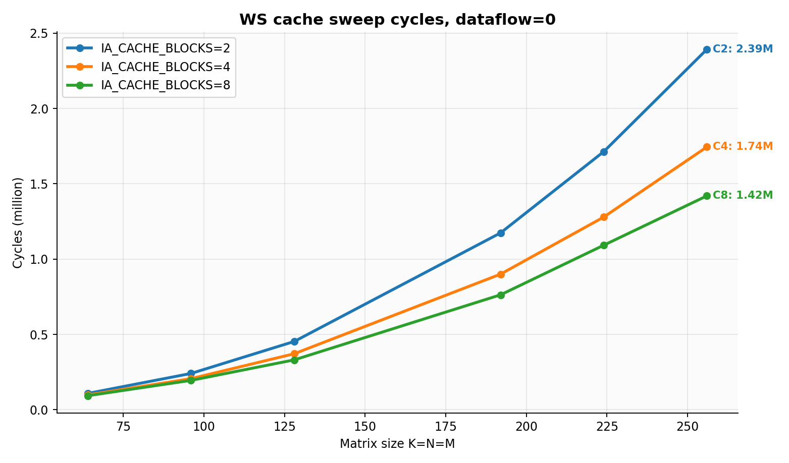
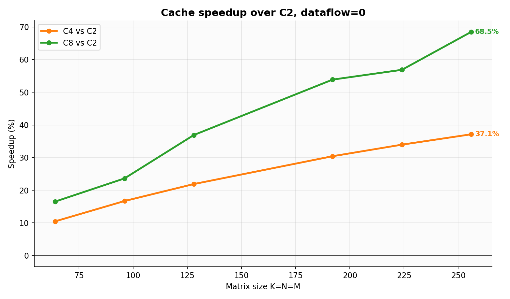
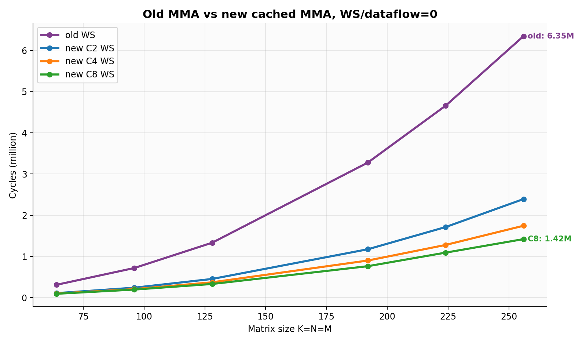
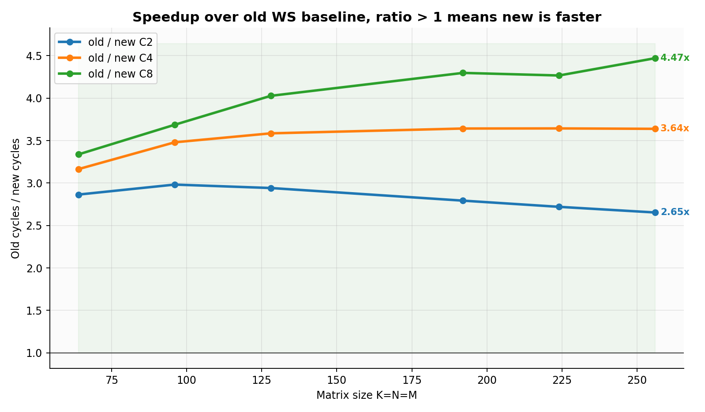
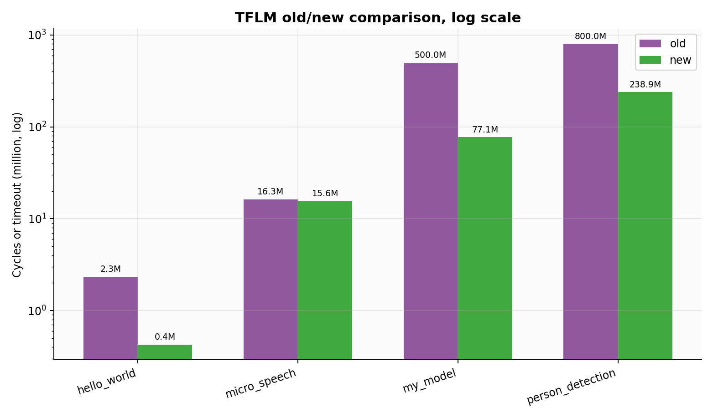

# MMA 新旧版本与 IA_CACHE_BLOCKS 性能分析报告

- 生成时间：2026-06-30 19:23:50
- 代码版本：`/media/proj_tmp/aiEngine_integrated` commit `0da2dcc`；旧版基线 `/media/proj_tmp/aiEngine_integrated_old_01d6506` commit `01d6506`
- 测试环境：DDR 随机延迟关闭；SoC 仿真；RISC-V 侧程序使用 `-O3`（旧版历史 TFLM 程序为旧 Makefile 配置）。
- 新版 MMA 配置：`MMA_SIZE=16`，`MMA_PS_FRAME_COUNT=16`，`lhs_dtype=s8`，`quant_mode=per-tensor`。
- 新版 cache sweep：`IA_CACHE_BLOCKS=[2, 4, 8]`，尺寸 `[64, 96, 128, 192, 224, 256]`，dataflow `[0]`，seed `88400`。
- 新版 sweep 结果：`18/18` 通过。

## 结论摘要

- 最终 WS sweep 中，新版 cached MMA 在 64/96/128/192/224/256 方阵上全部快于旧版 WS 基线，没有再出现负收益。
- `IA_CACHE_BLOCKS=8` 的新版 WS 相对旧版分别达到 3.34x/3.69x/4.03x/4.30x/4.27x/4.47x；矩阵放大后优势整体更明显。
- cache 增大带来的复用收益已经能在新架构内部稳定体现：C8 相对 C2 在所有 WS 尺寸上均更快，256 点降周期约 40.65%。
- 主要性能修复来自三处：OA 写回从单 beat 命令改成按输出行 burst；reuse=0 保留为 RTL 自动最大复用路径；runtime case 头和输出清零/比较去掉 volatile 字节循环开销。
- TFLM 端到端结果和裸 MMA 不完全一致：端到端包含算子调度、转置/打包、CPU 侧循环和模型结构，旧版部分大模型此前会 timeout；本报告使用加大 timeout 后的重跑日志更新该结论。
- 修改 `MMA_IA_CACHE_BLOCKS` 时，驱动公式会同步改变：Makefile 把它编译成 `-DDSA_IA_CACHE_BLOCKS=$(MMA_IA_CACHE_BLOCKS)`，普通 SoC runtime 和 TFLM kernel 都使用该宏选择 reuse 参数。

## 图 1：新版 cache 大小对周期的影响

## 新版 cache sweep 详细表

### dataflow=0 (WS)

| K=N=M | C2 cycles | C4 cycles | C8 cycles | C4 相对 C2 | C8 相对 C2 | C4 降周期 | C8 降周期 | C2 eff | C4 eff | C8 eff |
|---:|---:|---:|---:|---:|---:|---:|---:|---|---|---|
| 64 | 108,577 | 98,283 | 93,179 | 10.47% | 16.53% | 9.48% | 14.18% | R1/W4 | R2/W4 | R4/W4 |
| 96 | 241,008 | 206,528 | 194,957 | 16.70% | 23.62% | 14.31% | 19.11% | R1/W6 | R2/W6 | R4/W6 |
| 128 | 453,189 | 371,787 | 331,013 | 21.89% | 36.91% | 17.96% | 26.96% | R1/W8 | R2/W8 | R4/W8 |
| 192 | 1,173,994 | 900,206 | 762,978 | 30.41% | 53.87% | 23.32% | 35.01% | R1/W12 | R2/W12 | R4/W12 |
| 224 | 1,713,502 | 1,279,170 | 1,092,294 | 33.95% | 56.87% | 25.35% | 36.25% | R1/W14 | R2/W14 | R4/W14 |
| 256 | 2,392,617 | 1,744,729 | 1,419,987 | 37.13% | 68.50% | 27.08% | 40.65% | R1/W16 | R2/W16 | R4/W16 |

## 图 2：旧版 MMA 与新版 cached MMA 的 WS 直接对比

### 旧版 WS 与新版 WS 周期表

| K=N=M | 旧版 WS cycles | 新版 C2/WS | 新版 C4/WS | 新版 C8/WS | C2 vs 旧版 | C4 vs 旧版 | C8 vs 旧版 |
|---:|---:|---:|---:|---:|---:|---:|---:|
| 64 | 311,022 | 108,577 | 98,283 | 93,179 | 2.86x | 3.16x | 3.34x |
| 96 | 718,688 | 241,008 | 206,528 | 194,957 | 2.98x | 3.48x | 3.69x |
| 128 | 1,333,068 | 453,189 | 371,787 | 331,013 | 2.94x | 3.59x | 4.03x |
| 192 | 3,278,756 | 1,173,994 | 900,206 | 762,978 | 2.79x | 3.64x | 4.30x |
| 224 | 4,660,627 | 1,713,502 | 1,279,170 | 1,092,294 | 2.72x | 3.64x | 4.27x |
| 256 | 6,348,405 | 2,392,617 | 1,744,729 | 1,419,987 | 2.65x | 3.64x | 4.47x |

## 图 3：TFLM 端到端新旧版本对比

| Case | 旧版状态 | 旧版 cycles/timeout | 新版状态 | 新版 cycles | 新版优势 | 说明 |
|---|---|---:|---|---:|---:|---|
| hello_world | pass | 2,337,257 | pass | 425,071 | 5.50x | 新版降周期 81.81% |
| micro_speech | pass | 16,295,115 | pass | 15,590,371 | 1.05x | 新版降周期 4.32% |
| my_model | timeout | 500,000,000 | pass | 77,111,410 | >=6.48x | 旧版在 500,000,000 cycles 仍未完成，优势为下界 |
| person_detection | timeout | 800,000,000 | pass | 238,905,507 | >=3.35x | 旧版在 800,000,000 cycles 仍未完成，优势为下界 |

## 为什么会出现这些结果

### 1. 负收益的根因已经被消掉

优化前新版慢于旧版，主要不是计算阵列本身吞吐不够，而是控制流和仿真 runtime 的固定开销太重：OA writer 每个 beat 发一次写命令，写响应等待频繁打断数据流；驱动把自动 reuse 重新折算成保守配置，导致 IA/kernel DMA 重复；统一 runtime 又在 volatile 字节循环里消耗了大量周期。当前版本把这些路径分别改成行 burst、自动最大复用、word 级清零/比较后，小矩阵也不再负收益。

### 2. 小矩阵仍受固定开销限制，但已经快于旧版

64x64x64 的 tile 数少，DMA 启动、cache fill、写回收尾和 CPU 配置成本占比高，所以 cache 从 C2 增到 C8 的内部收益仍小于大矩阵。不过最终 C8/WS 已从旧版 311,022 cycles 降到 93,179 cycles，达到 3.34x。

### 3. 大矩阵更能体现 cache 复用价值

矩阵变大后，IA 分块在 L1/cache 中连续复用的次数增加，kernel 侧窗口也随输出列 tile 增大。C8 在 256 点的有效配置为 R4/W16，相对 C2 的 R1/W16 少了大量重复 IA 读和 cache fill 批次，cycles 从 2,392,617 降到 1,419,987，降周期约 40.65%。

### 4. C8 在最终 WS sweep 中稳定优于 C4/C2

此前 C8 偶尔不如 C4，是因为更大的复用窗口被写回气泡和保守 reuse 选择抵消。修复后 64 到 256 的 WS 点中，C8 全部为最优；这说明当前控制流已经能把更大的 IA cache 转化成有效复用，而不是只增加等待。

### 5. 驱动 cache 参数是否同步

已确认同步。`veri/sim/Makefile` 中 `SOC_HW_DEFINES := -DDSA_TILE_SIZE=$(MMA_SIZE) -DDSA_IA_CACHE_BLOCKS=$(MMA_IA_CACHE_BLOCKS)`，并用于 SoC runtime 编译和 TFLM 库编译。普通驱动和 `veri/soc_csrc/dsa_accel_mmio.c` 都保留 `reuse=0` 的自动路径；显式非零 reuse 才会按 `DSA_IA_CACHE_BLOCKS` 和输出列 tile 数 clamp。TFLM 的 `conv.cc/depthwise_conv.cc` 也把 `DSA_IA_CACHE_BLOCKS` 编译成 `kMmaIaCacheBlocks` 参与 reuse 选择。

## 功能正确性与 timeout 处理

- 新版大尺寸 cache sweep 已全部 PASS，且没有发现 `FAIL/Mismatch/TIMEOUT/UVM_ERROR/TEST FAIL`。
- 旧版裸 MMA WS 基线 64/96/128/192/224/256 全部 PASS。
- 旧版 TFLM 中此前 timeout 的 `my_model` 和 `person_detection` 已使用更大 timeout 目录重跑；状态以本文 TFLM 表为准。

## 数据文件与图片

- 新版 cache sweep CSV：`/media/proj_tmp/aiEngine_integrated/veri/sim/runs/ws_cache_final_nolat_auto/perf.csv`
- 旧版裸 MMA WS CSV：`/media/proj_tmp/aiEngine_integrated_old_01d6506/veri/sim/runs/old_mma_ws_perf_nolat_large/perf.csv`
- 新版 TFLM 日志根目录：`/media/proj_tmp/aiEngine_integrated/veri/sim/runs/compare_nolat_new`
- 旧版 TFLM 日志根目录：`/media/proj_tmp/aiEngine_integrated_old_01d6506/veri/sim/runs/compare_nolat_old`
- 生成图片：
  - `plots/cache_cycles_by_dim_df0.png`
  - `plots/cache_speedup_vs_c2_df0.png`
  - `plots/old_new_mma_ws_cycles.png`
  - `plots/old_new_mma_ws_ratio.png`
  - `plots/tflm_old_new_cycles.png`
